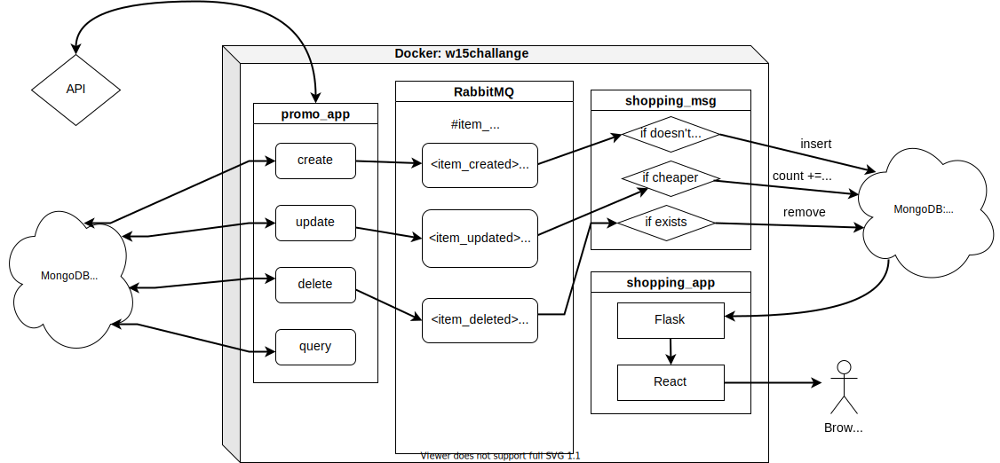

# About This Repo

This repo contains the code for a coding challenge I started working on back in W15.

The coding challenge involves 1) creating two microservices using either Flask or Django and a database and 2) let the two microservices communicate via a message broker. There is a third part in the challenge and I didn't solve it.

### Structure of the project

In my end product for this coding challenge, three microservices are launched from a Docker container. `promo_app` emulates a flyer of items on promotion at a supermarket. `shopping_app` emulates a shopping list of a consumer. The two apps communicate through `RabbitMQ`, which runs from its official Docker image. Since I tried to fix a possible bug–it was probably not a bug–the messaging part on the shopping side is made into `shopping_msg`.

How this project works is illustrated in the following chart:

`promo_app` provides four APIs to create an item, change the price, delete an item or query an item name.

Updates of items and prices are saved to MongoDB in the cloud and relevant updates are produced to the message queue run by `RabbitMQ`. 

`shopping_msg` then consumes messages from the queue and decides whether to add or remove an item in the shopping list by making changes to MongoDB.

`shopping_app` queries items in MongoDB and renders the shopping list in browser. 

### Folders and files

`promo_app.py` is found in folder `PromoFlyer`. `shopping_app.py` is found in folder `ShoppingList`.

`msg_consumer.py` locates at `ShoppingMsgConsumer`, I should've changed its name to `shopping_msg.py` though to be match the chart.